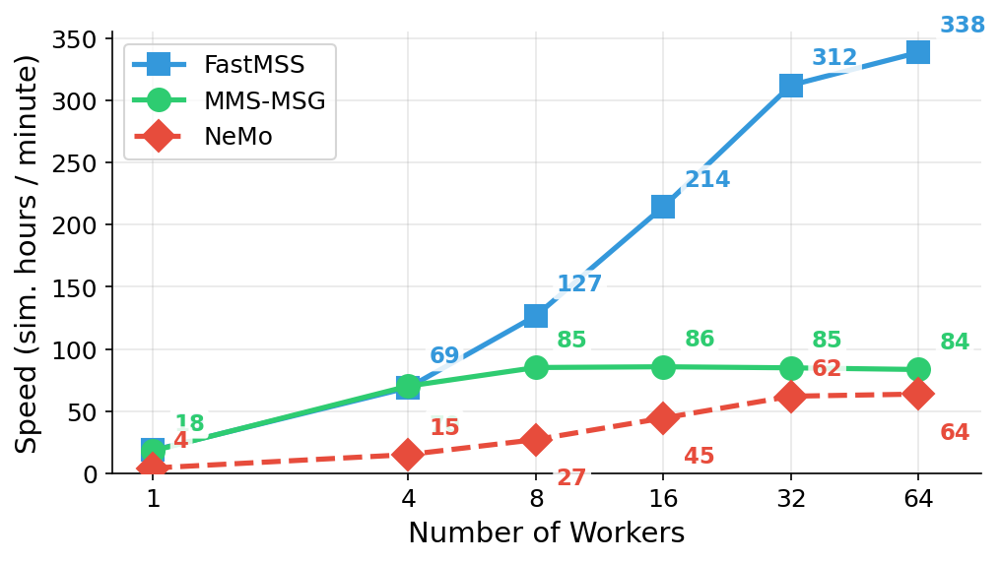

# FastMSS: Fast Multi-Speaker Simulation

FastMSS is a toolkit for generating realistic multi-speaker meeting scenarios using room impulse response (RIR) simulation and HMM-based turn-taking models. It can dump per-speaker anechoic and reverberant reference signals, making it suitable for training speech separation and enhancement models in addition to speaker-attributed ASR and speaker diarization systems.

## Speed

<p align="center">
  
</p>

Generation throughput (simulated hours per minute) as a function of the number of parallel workers on a DGX node. FastMSS scales near-linearly and is significantly faster than [MMS-MSG](https://github.com/fgnt/mms_msg) and [NeMo](https://github.com/NVIDIA/NeMo) simulators.

## Features

- **HMM-based turn-taking** — models 4 transition types (turn hold, turn switch, interruption, backchannel) with configurable probabilities; can fit transitions to real corpora (AMI, CallHome, NOTSOFAR-1) or use flat priors
- **Overlap control** — boost overlap factor to increase/decrease interruption and backchannel rates
- **Room simulation** — RIR generation via pyroomacoustics with configurable room geometry and RT60
- **Per-speaker outputs** — optionally save individual speaker streams and anechoic references for separation/enhancement training
- **Noise augmentation** — add real noise (e.g. WHAM, MUSAN) at configurable SNR ranges
- **Lhotse integration** — reads source speech from lhotse CutSets with word-level alignments; outputs lhotse-compatible manifests
- **RTTM + NeMo manifests** — optionally generate RTTM files and NeMo-style diarization manifests
  
## Installation

```bash
git clone https://github.com/popcornell/FastMSS.git
cd FastMSS
pip install -e .
```

## Project Structure

```
FastMSS/
├── fastmss/                     # Core simulation library
│   ├── simulator.py             # Meeting generation engine
│   ├── hmm_turn_taking.py       # HMM turn-taking model
│   ├── rirsimulator.py          # RIR generation via pyroomacoustics
│   └── utils.py                 # Audio splitting, crossfading utilities
├── recipes/
│   ├── sim.py                   # Unified simulation pipeline
│   ├── default.yaml             # Default config with sensible defaults
│   └── paper/                   # Configs to reproduce paper experiments
│       ├── ts_asr/              # TS-ASR experiment configs (Table 1 & 2)
│       └── diarization/         # Diarization experiment configs
├── preprocessing/
│   ├── download_wham.sh         # Download WHAM noise dataset
│   ├── download_otospeech.sh    # Download + prepare otoSpeech dataset
│   └── resample_folder.py       # General audio resampling utility
├── setup.py
└── requirements.txt
```

## Quick Start

### 1. Prepare source data

FastMSS takes single-speaker audio in [lhotse](https://github.com/lhotse-speech/lhotse) format as input. You can use any speech corpus — here are two common options:

```bash
# Option A: LibriSpeech (via lhotse)
lhotse download librispeech --full /path/to/librispeech
lhotse prepare librispeech /path/to/librispeech /path/to/manifests

# Option B: otoSpeech (from HuggingFace)
bash preprocessing/download_otospeech.sh /path/to/manifests /path/to/otospeech

# Optional: download WHAM noise for augmentation
bash preprocessing/download_wham.sh /path/to/wham
```

### 2. Generate meetings

All paths are set via Hydra CLI overrides — no config file editing needed:

```bash
# Basic: 1000 meetings, 2-4 speakers, 60s each, flat turn-taking priors
python recipes/sim.py \
    output_dir=/path/to/output \
    manifest_dir=/path/to/manifests \
    n_meetings=1000 \
    duration=60 \
    n_jobs=16

# With noise + reverberation
python recipes/sim.py \
    output_dir=/path/to/output \
    manifest_dir=/path/to/manifests \
    noise_folders=[/path/to/wham] \
    add_noise=true \
    reverberate=true \
    n_jobs=16

# Save per-speaker anechoic references (for separation/enhancement)
python recipes/sim.py \
    output_dir=/path/to/output \
    manifest_dir=/path/to/manifests \
    save_spk=true \
    save_anechoic=true \
    reverberate=true \
    n_jobs=16

# Generate RTTM + NeMo manifests (for diarization)
python recipes/sim.py \
    output_dir=/path/to/output \
    manifest_dir=/path/to/manifests \
    save_rttm=true \
    save_nemo_manifest=true \
    n_jobs=16
```

### Key parameters

**General:**

| Parameter | Description | Default |
|-----------|-------------|---------|
| `output_dir` | Where to write simulated audio + manifests | — |
| `manifest_dir` | Directory with lhotse source manifests | — |
| `n_meetings` | Number of meetings to generate | `1000` |
| `duration` | Target meeting duration in seconds | `60` |
| `min_max_spk` | Speaker count range `[min, max]` | `[2, 4]` |
| `n_jobs` | Parallel workers | `8` |

**Augmentation (all independently toggleable):**

| Parameter | Description | Default |
|-----------|-------------|---------|
| `reverberate` | Apply room impulse responses to the mix | `false` |
| `reverb_prob` | Probability of applying RIR per meeting (if `reverberate=true`) | `0.5` |
| `rt60` | RT60 range in seconds | `[0.1, 0.7]` |
| `room_sz` | Room dimensions range in meters | `[5, 10]` |
| `n_rirs` | Number of RIRs to pre-simulate | `5000` |
| `add_noise` | Add background noise to the mix | `false` |
| `noise_folders` | Noise audio directories (list) | `null` |
| `noise_rel_gain` | Noise gain relative to speech (dB range) | `[-20, -3]` |
| `noise_probability_global` | Probability of adding noise per meeting | `0.5` |
| `speed_perturb` | Apply speed perturbation to source utterances | `false` |
| `speed_perturb_range` | Speed perturbation factor range | `[0.95, 1.05]` |
| `use_fir` | Apply FIR filtering | `false` |

**Output options:**

| Parameter | Description | Default |
|-----------|-------------|---------|
| `save_spk` | Save per-speaker audio streams | `false` |
| `save_anechoic` | Save anechoic (dry) per-speaker references | `false` |
| `save_rttm` | Generate RTTM files (Stage 5) | `false` |
| `save_nemo_manifest` | Generate NeMo-style diarization manifest | `false` |

**Turn-taking:**

| Parameter | Description | Default |
|-----------|-------------|---------|
| `hmm_params.p_ind` | Transition probabilities `[hold, switch, interruption, backchannel]` | `[0.25, 0.25, 0.25, 0.25]` |
| `hmm_fit_transitions_to` | Fit HMM to a target corpus (path to lhotse manifest) | `null` |
| `boost_overlap_factor` | Scale interruption/backchannel rates | `null` |
| `use_markov` | Use Markov chain for state transitions | `false` |
| `stage` | Start from this pipeline stage | `0` |

## Turn-Taking Model

FastMSS uses a 4-state HMM to model conversational dynamics. At each turn boundary, the model samples one of:

| Transition | Description | Effect |
|------------|-------------|--------|
| **Turn Hold** | Same speaker continues | No overlap, natural pause |
| **Turn Switch** | New speaker takes the floor | No overlap, speaker change |
| **Interruption** | New speaker starts before current finishes | Partial overlap |
| **Backchannel** | Brief interjection while speaker continues | Short overlap |

Transition probabilities can be set to uniform (`flat`), fitted to a target corpus via `hmm_fit_transitions_to`, or manually specified via `hmm_params.p_ind`. The `boost_overlap_factor` parameter scales the interruption and backchannel probabilities to increase or decrease overall overlap.

## Reproducing Paper Experiments

The `recipes/paper/` directory contains the exact configs used in the Interspeech 2026 paper. To run them, override the config name:

```bash
# TS-ASR Table 1: flat turn-taking priors
python recipes/sim.py \
    --config-name paper/ts_asr/table1/flat \
    output_dir=/path/to/output \
    manifest_dir=/path/to/manifests

# Diarization: 2-speaker clean with overlap boosting
python recipes/sim.py \
    --config-name paper/diarization/clean/librispeech_2spk \
    output_dir=/path/to/output \
    manifest_dir=/path/to/manifests
```

## Citation

If you use FastMSS in your research, please cite:

```bibtex
@inproceedings{polok2026mindthegap,
    title     = {Mind the Gap: Impact of Synthetic Conversational Data 
                 on Multi-Talker {ASR} and Speaker Diarization},
    author    = {Polok, Alexander and Cornell, Samuele and Medennikov, Ivan 
                 and Watanabe, Shinji and {\v{C}}ernock{\'y}, Jan 
                 and Burget, Luk{\'a}{\v{s}}},
    booktitle = {Submitted to Interspeech},
    year      = {2026},
}
```
